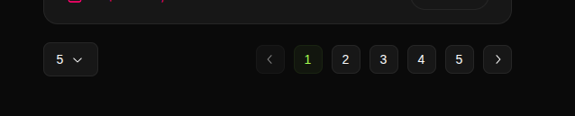
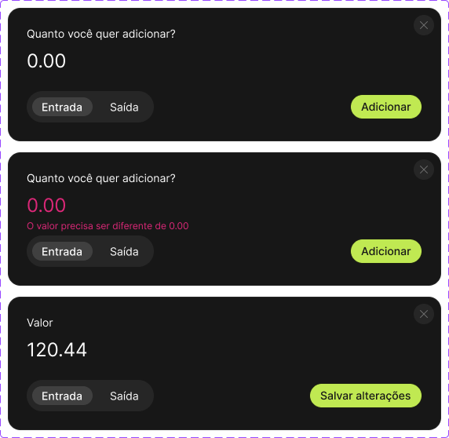
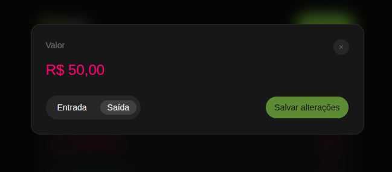

<p align="center">
  
</p>

<h1 align="center">Planey - Aplicacao de Controle Financeiro</h1>

Aplicacao web de controle financeiro desenvolvida como desafio tecnico. Permite inserir, atualizar, excluir e listar valores financeiros com paginacao, filtros e gerenciamento de estado via URL.

## Stack Tecnica

### Base
- **Vite** + **React** + **TypeScript**
- **Tailwind CSS** para estilizacao
- **Radix UI** para componentes acessiveis
- **Radix Icons** para icones

### Estado, Dados e Rotas
- **TanStack Query** - gerenciamento de estado assincrono e cache
- **TanStack Router** - gerenciamento de rotas e query params
- **JSON Server** - simulacao de backend com persistencia

### Formularios e Validacao
- **React Hook Form** - gerenciamento de formularios
- **Zod** - validacao de dados

### Testes
- **Vitest** - testes unitarios
- **Playwright** - testes end-to-end

## Arquitetura

O projeto segue a arquitetura **MVVM** (Model-View-ViewModel) para separacao de responsabilidades:

```
src/
  api/           # Camada de comunicacao com API
  components/    # Componentes de UI (View)
  hooks/         # React Query hooks
  lib/           # Utilitarios e configuracoes
  types/         # Tipos TypeScript (Model)
  view-models/   # Logica de apresentacao (ViewModel)
```

## Instalacao

```bash
# Clonar repositorio
git clone https://github.com/nuelst/planey.git
cd planey

# Instalar dependencias
bun install

# Copiar arquivo de ambiente
cp .env.example .env
```

## Como Executar

```bash
# Iniciar aplicacao e servidor JSON (recomendado)
bun run dev:all

# Ou separadamente:
bun run dev          # Frontend (porta 3000)
bun run dev:server   # JSON Server (porta 3001)
```

Acesse: http://localhost:3000

## Testes

```bash
# Testes unitarios
bun run test

# Testes E2E
bun run test:e2e

# Testes E2E com interface visual
bun run test:e2e:ui
```

## Scripts Disponiveis

| Script | Descricao |
|--------|-----------|
| `dev` | Inicia o frontend |
| `dev:server` | Inicia o JSON Server |
| `dev:all` | Inicia frontend e backend |
| `build` | Build de producao |
| `test` | Executa testes unitarios |
| `test:e2e` | Executa testes E2E |
| `lint` | Verifica codigo com Biome |
| `format` | Formata codigo com Biome |

## Funcionalidades

- CRUD completo de transacoes (entradas e saidas)
- Formatacao de moeda brasileira (R$) em tempo real
- Filtros por tipo de transacao (entradas, saidas, excluidos)
- Paginacao com selecao de itens por pagina
- Soft delete com opcao de restaurar
- Modais controlados por URL (query params)
- Estado persistido na URL para compartilhamento

## Decisoes de UI/UX

### Paginacao com Seletor de Quantidade

O design original do Figma apresentava apenas a paginacao centralizada:


Como o requisito exigia permitir alterar a quantidade de itens por pagina, foi adicionado um seletor (select) a esquerda. Para manter o layout equilibrado, foi aplicado `justify-between`, posicionando o seletor a esquerda e os botoes de paginacao a direita:



### Modal de Edicao com Botao Desabilitado

O design original apresentava tres estados da modal:



Foi identificado que ao editar uma transacao, o usuario poderia clicar em "Salvar alteracoes" sem ter alterado nenhum valor, gerando uma atualizacao desnecessaria no servidor.

Para melhorar a experiencia do usuario, foi implementada uma validacao que desabilita o botao de submit quando a modal esta em modo de edicao e o valor nao foi alterado:



Esta decisao:
- Evita requisicoes desnecessarias ao servidor
- Deixa claro ao usuario que nenhuma alteracao foi feita
- Mantem o botao habilitado assim que qualquer alteracao e detectada

## Estrutura do Banco de Dados

```json
{
  "transactions": [
    {
      "id": "tx_001",
      "type": "income",
      "amount": 125000,
      "deletedAt": null,
      "createdAt": "2026-01-28T12:00:00.000Z",
      "updatedAt": "2026-01-28T12:00:00.000Z"
    }
  ]
}
```

- `amount`: Valor em centavos (125000 = R$ 1.250,00)
- `type`: "income" (entrada) ou "outcome" (saida)
- `deletedAt`: null para ativos, timestamp para excluidos (soft delete)

## Autor

**Manuel dos Santos**

- GitHub: [github.com/nuelst](https://github.com/nuelst)
- LinkedIn: [linkedin.com/in/nuelst](https://linkedin.com/in/nuelst)

## Licenca

Este projeto foi desenvolvido como parte de um desafio tecnico.
